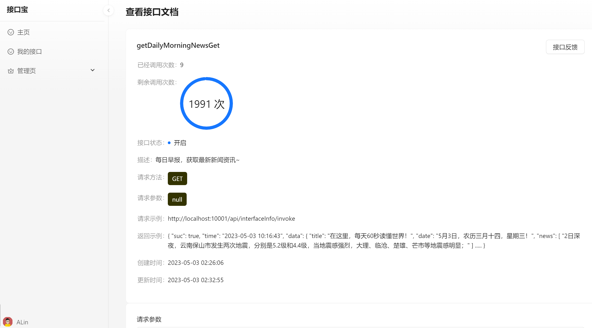
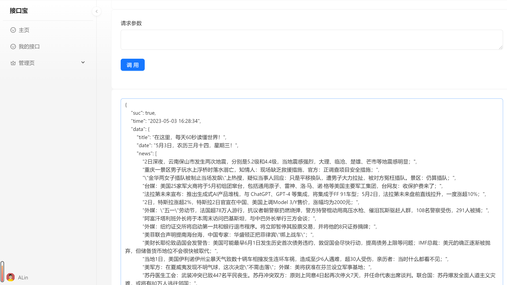

# jiekoubao-api
# 前言
*接口宝*项目是为了给开发者提供快捷的、稳定的的接口调用服务。
# 项目介绍
1. *接口宝*项目是一套接口服务系统，分为前台接口系统和后台管理系统，基于SpringBoot+Mybatis实现。前台包含首页门户、
   接口调用页、用户个人信息页、接口详情页。后台包含接口管理、用户管理、用户接口管理、接口查询、接口统计报表、权限管理等模块。
2. 此项目分为以下模块 
api-backend-project
├──api-backend -- 模拟用户调用接口以及主要代码逻辑实现
├──api-client-sdk -- 给用户使用的sdk
├──api-common -- 公共服务模块
├──api-frontinterface -- 接口的主要实现逻辑
├──api-gateway -- 接口网关服务模块
├──api-rpc -- 远程调用模块
└──api-sms -- 短信验证服务模块

# 项目演示



# 技术选型
## 后端技术
| 技术      | 说明     | 官网     |
| ---------- | :-----------:  | :-----------: |
| SpringBoot     | 	Web应用开发框架     | https://spring.io/projects/spring-boot   |
| SpringCloudGateway     | 		后端网关框架     | https://cloud.spring.io/spring-cloud-gateway/reference/html/   |
| Dubbo     | 		Java RPC框架     | https://cn.dubbo.apache.org/zh-cn/index.html  |
| Nacos     | 		动态服务发现、配置和服务管理平台     | https://nacos.io/zh-cn/docs/v2/quickstart/quick-start.html |
| MyBatis    | 		ORM框架    | http://www.mybatis.org/mybatis-3/zh/index.html  |
| Mysql     | 		数据存储     | 	https://dev.mysql.com/doc/ |
| Redis     | 		内存数据存储     | 	https://redis.io/  |
| Nginx     | 	静态资源服务器     | https://www.nginx.com/   |
| Docker     | 		应用容器引擎    | https://www.docker.com   |
| OSS     | 		对象存储     | 	https://github.com/aliyun/aliyun-oss-java-sdk   |
| SMS     | 		短信服务     | 	https://github.com/aliyun/aliyun-sms-java-sdk   |
| Lombok     | 		Java语言增强库     | https://github.com/rzwitserloot/lombok   |
| Hutool     | 		Java工具类库     | https://github.com/looly/hutool   |
| Swagger-UI     | 			API文档生成工具     | https://github.com/swagger-api/swagger-ui   |
| Hutool     | 		Java工具类库     | https://github.com/looly/hutool   |
## 前端技术
| 技术      | 说明     | 官网     |
| ---------- | :-----------:  | :-----------: |
| React     | 	前端框架     | https://zh-hans.reactjs.org/learn   |
| Ant Design Pro     | 	开箱即用的中台前端     | https://pro.ant.design/zh-CN/docs/overview  |
|   Ant Design Procomponents   | 	框架组件    | https://procomponents.ant.design/docs  |
|   Umi   | 	底层前端框架    | https://umijs.org/docs/tutorials/getting-started  |
| Echarts    | 		基于Echarts的图表框架     | https://echarts.apache.org/handbook/zh/get-started/ |
# 环境搭建
## 开发工具
| 工具      | 说明     | 官网     |
| ---------- | :-----------:  | :-----------: |
| IDEA     | 	开发后端代码     | 	https://www.jetbrains.com/idea/download  |
| RedisDesktop    | 	redis客户端连接工具    | 	https://github.com/qishibo/AnotherRedisDesktopManager |
| X-shell   | 			Linux远程连接工具    | 	http://www.netsarang.com/download/software.html |
| PowerDesigner   | 	数据库设计工具  | http://powerdesigner.de/ |
| SQLyog   | 			数据库连接工具    | 	https://webyog.com/product/sqlyog/ |
| Typora  | 			Markdown编辑器    | 	https://typora.io/ |
| Postman  | 				API接口调试工具  | 	https://www.postman.com/ |
| Jmeter   | 	压力测试工具   | 	https://jmeter.apache.org/ |
# 开发环境
| 工具      | 版本号     | 下载     |
| ---------- | :-----------:  | :-----------: |
| JDK     | 	1.8     | 		https://www.oracle.com/technetwork/java/javase/downloads/jdk8-downloads-2133151.html  |
| Mysql  | 	5.7   | https://www.mysql.com/ |
| Redis   | 	6.2.6   | 	https://jmeter.apache.org/ |
| Nginx   | 	1.22.0   | 	http://nginx.org/en/download.html |
```
